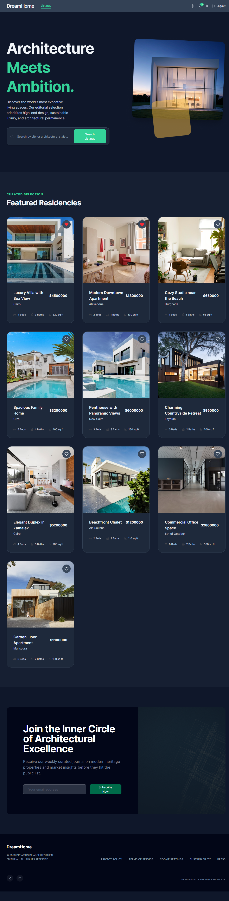
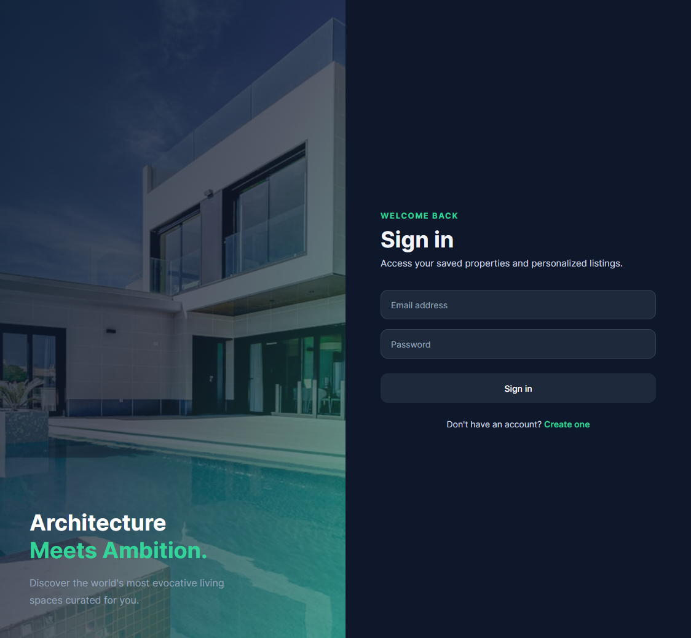
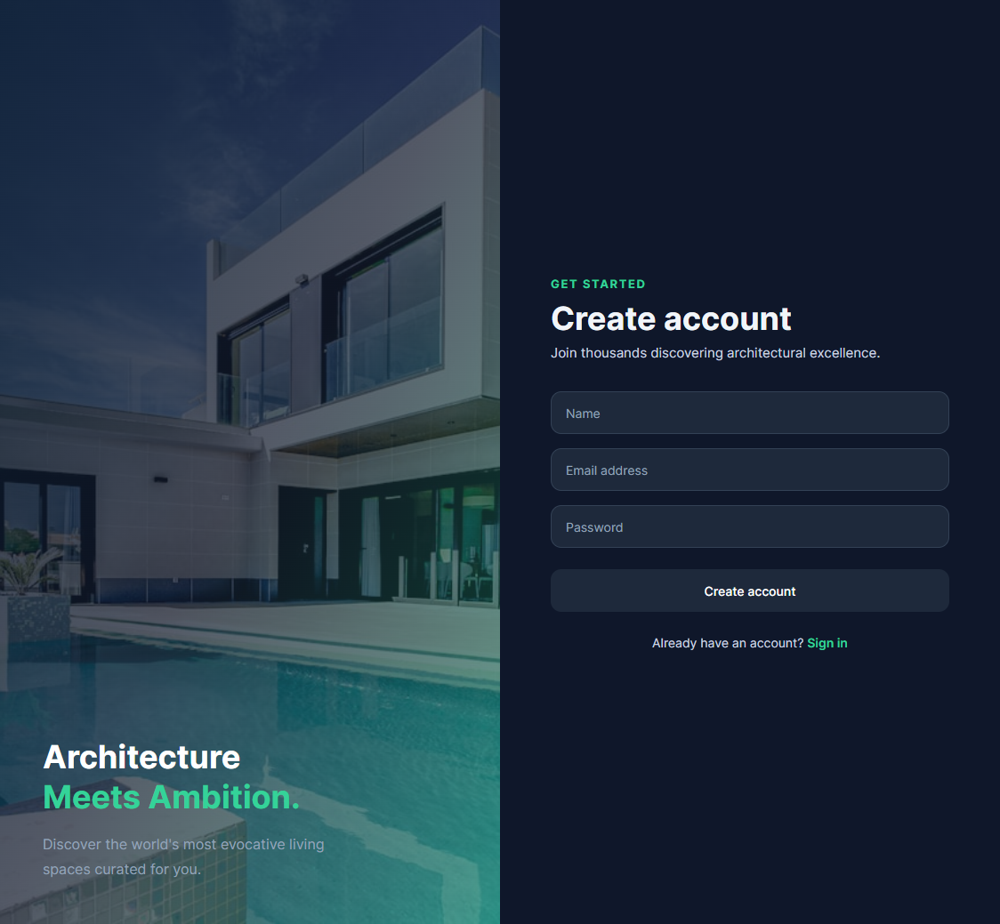
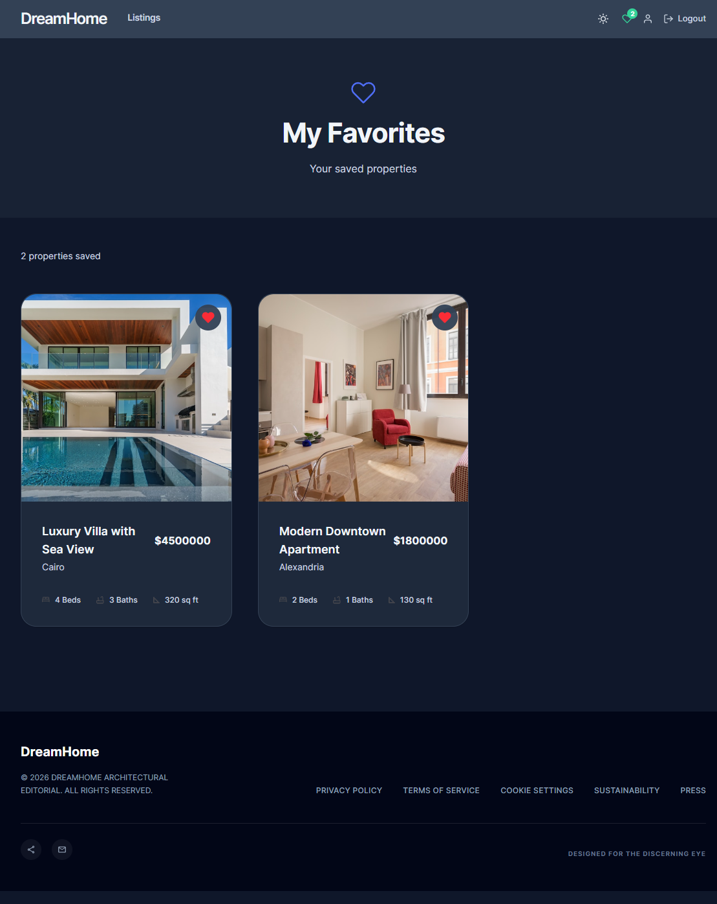
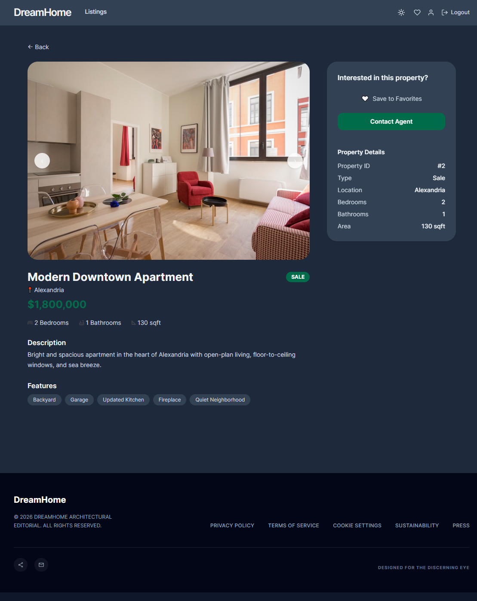
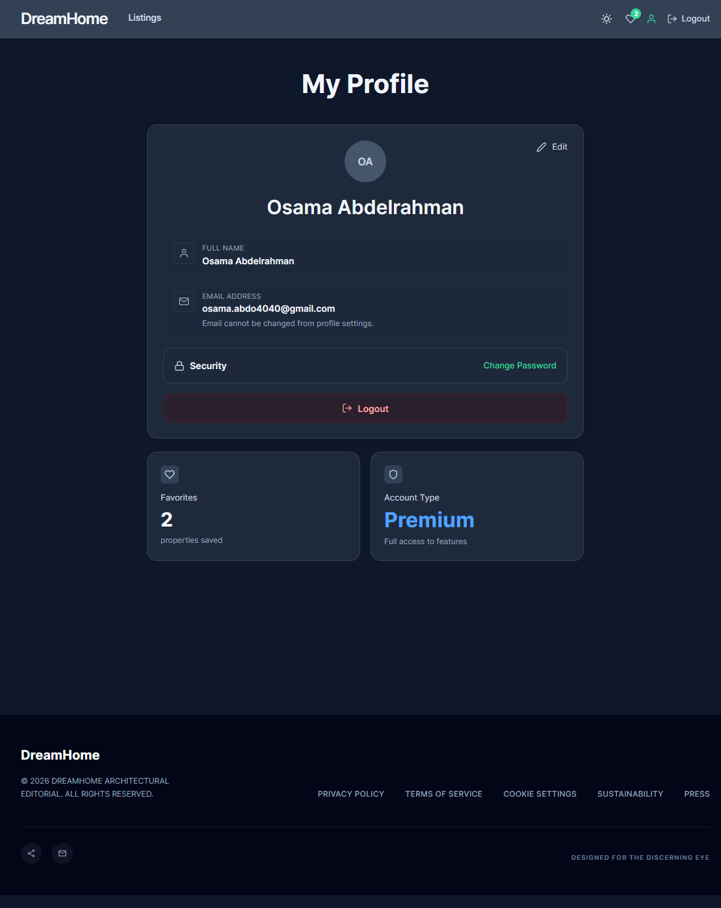

# 🏠 Real Estate App

A modern real estate browsing platform built with **React**, **TypeScript**, and **Vite**. Users can explore property listings, save their favorites, and manage their accounts — all powered by a local JSON Server backend.

---

## ✨ Features

- 🔐 **User Authentication** — Register and login with form validation
- 🏘️ **Property Listings** — Browse properties across multiple Egyptian cities
- ❤️ **Favorites System** — Save and manage your favorite properties per user
- 🔍 **Property Details** — View full details including price, area, bedrooms, and bathrooms
- 📱 **Responsive Design** — Built with Tailwind CSS for a clean, mobile-friendly UI
- 🔔 **Toast Notifications** — Instant feedback on user actions

---

## 📸 Screenshots

### 🏠 Home


### 🔐 Login


### 📝 Register


### ❤️ Favorites


### 🏡 Property Details


### 👤 Profile


---

## 🛠️ Tech Stack

| Category | Technology |
|---|---|
| Frontend Framework | React 19 |
| Language | TypeScript |
| Build Tool | Vite |
| Styling | Tailwind CSS v4 |
| Routing | React Router DOM v7 |
| HTTP Client | Axios |
| Form Handling | Formik + Yup |
| Notifications | React Toastify |
| Icons | React Icons |
| Mock Backend | JSON Server |

---

## 📁 Project Structure

```
real_state/
├── public/               # Static assets
├── src/                  # Application source code
│   ├── components/       # Reusable UI components
│   ├── pages/            # Page-level components
│   ├── services/         # API calls (Axios)
│   └── ...
├── db.json               # JSON Server database (properties, users, favorites)
├── .env.example          # Environment variable template
├── vite.config.ts        # Vite configuration
├── tsconfig.json         # TypeScript configuration
└── package.json          # Dependencies and scripts
```

## 🚀 Getting Started

### Prerequisites

- [Node.js](https://nodejs.org/) v18+
- npm

### Installation

```bash
# 1. Clone the repository
git clone https://github.com/aymankhaled4/real_state.git
cd real_state

# 2. Install dependencies
npm install

# 3. Start the JSON Server (mock backend) — in a separate terminal
npx json-server --watch db.json --port 3001

# 4. Start the development server
npm run dev
```

The app will be available at **http://localhost:5173**
The API will be available at **http://localhost:3001**

---

## 🗄️ Data Model

The app uses `db.json` as its mock database with three collections:

### Properties
```json
{
  "id": "1",
  "title": "Luxury Villa with Sea View",
  "price": 4500000,
  "city": "Cairo",
  "image": "https://...",
  "description": "...",
  "bedrooms": 4,
  "bathrooms": 3,
  "area": 320
}
```

### Users
```json
{
  "id": "1",
  "name": "Ahmed Hassan",
  "email": "ahmed@example.com",
  "password": "password123"
}
```

### Favorites
```json
{
  "id": "1",
  "userId": "1",
  "propertyId": "3"
}
